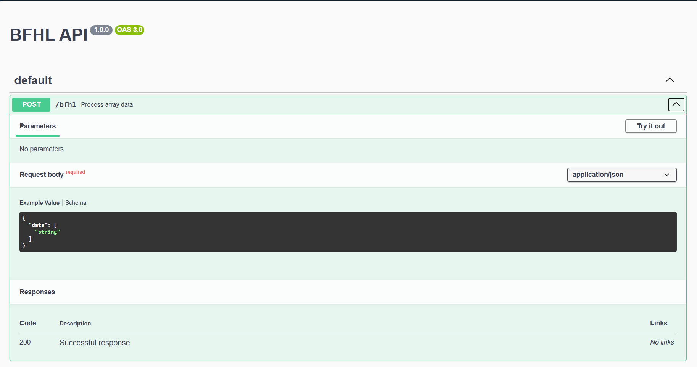
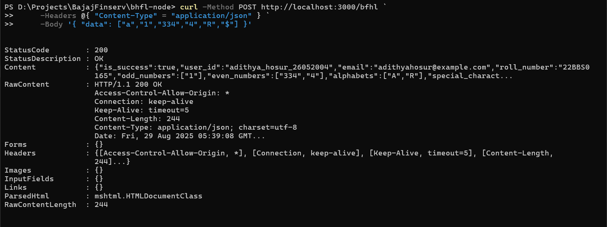

# 🚀 BFHL API (Node.js + Express)


A simple REST API built for the **BFHL Challenge**.  
Processes an array of input values and classifies them into numbers, alphabets, special characters, etc.  

## Features
- ✅ POST `/bfhl` → processes input and returns structured JSON  
- ✅ GET `/` → health check route (returns "BFHL API is running ✅")  
- ✅ GET `/docs` → Swagger API documentation  
- ✅ Error handling for invalid requests  
- ✅ Numbers are returned as **strings**  
- ✅ Logging with `morgan`  

---

## 📌 Tech Stack
- [Node.js](https://nodejs.org/)  
- [Express.js](https://expressjs.com/)  
- [Swagger UI](https://swagger.io/tools/swagger-ui/)  
- [Morgan](https://www.npmjs.com/package/morgan)  

---

## 📌 Run Locally

1. Clone this repo:
   ```
   git clone https://github.com/<your-username>/bfhl-node.git
   cd bfhl-node
    ```

2. Install dependencies:

   ```
   npm install
   ```

3. Copy `.env.example` to `.env` and fill your details:

   ```
   FULL_NAME=adithya_hosur
   DOB_DDMMYYYY=26052004
   EMAIL=adithyahosur@example.com
   ROLL_NUMBER=22BBS0165
   PORT=3000
   ```

4. Start server:

   ```bash
   npm run dev   # auto reload with nodemon
   # or
   npm start
   ```

5. Test endpoints:

   * Health: [http://localhost:3000/](http://localhost:3000/)
   * API: [http://localhost:3000/bfhl](http://localhost:3000/bfhl) (POST only)
   * Docs: [http://localhost:3000/docs](http://localhost:3000/docs)


---

## Example

### Request

```json
{ "data": ["a","1","334","4","R","$"] }
```

### Response

```json
{
  "is_success": true,
  "user_id": "adithya_hosur_26052004",
  "email": "adithyahosur@example.com",
  "roll_number": "22BBS0165",
  "odd_numbers": ["1"],
  "even_numbers": ["334","4"],
  "alphabets": ["A","R"],
  "special_characters": ["$"],
  "sum": "339",
  "concat_string": "Ra"
}
```

---

## Screenshots


### Swagger Docs 


### Curl Testing



## Author

👨‍💻 Developed by **Adithya Hosur**


